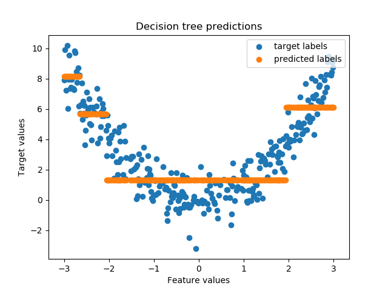
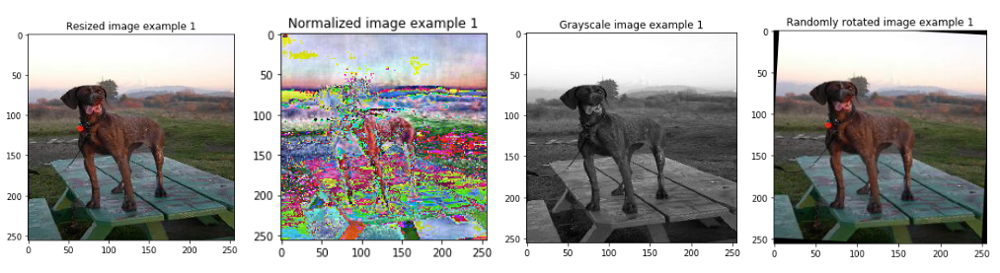

# Machine learning basics

This repository contains implementations of basic machine learning algorithms in plain Python (Python Version 3.6+). All algorithms are implemented from scratch without using additional machine learning libraries. The intention of these notebooks is to provide a basic understanding of the algorithms and their underlying structure, *not* to provide the most efficient implementations. 

- [Linear Regression](linear_regression.ipynb)
- [Logistic Regression](logistic_regression.ipynb)
- [Perceptron](perceptron.ipynb)
- [k-nearest-neighbor](k_nearest_neighbour.ipynb)
- [k-Means clustering](kmeans.ipynb)
- [Simple neural network with one hidden layer](simple_neural_net.ipynb)
- [Multinomial Logistic Regression](softmax_regression.ipynb)
- [Decision tree for classification](decision_tree_classification.ipynb)
- [Decision tree for regression](decision_tree_regression.ipynb)
  
  

## Data preprocessing

After several requests I started preparing notebooks on how to preprocess datasets for machine learning. Within the next months I will add one notebook for each kind of dataset (text, images, ...). As before, the intention of these notebooks is to provide a basic understanding of the preprocessing steps, *not* to provide the most efficient implementations. 

- [Image preprocessing](image_preprocessing.ipynb)
- [Preprocessing a numerical/categorical dataset](data_preprocessing.ipynb)

## Feedback

If you have a favorite algorithm that should be included or spot a mistake in one of the notebooks, please let me know by creating a new issue.

## License

See the LICENSE file for license rights and limitations (MIT).
